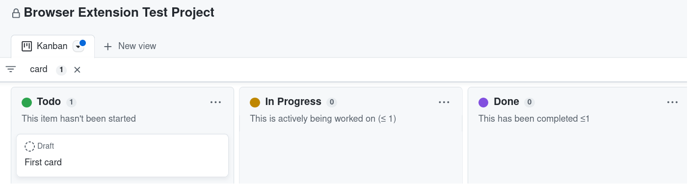

## Developer Guide

This is a pretty simple extension, so there is not much to it in terms of building and testing.

### Prerequisites

### Building Prerequisites

To build the extension package you need:

1. A unix shell (e.g. `bash`)
2. The `zip` utility
3. `grep`
4. `sed`

### Testing Prerequisites

You need a GitHub account, either on GitHub.com or on a GitHub Enterprise

### Testing

We expect GitHub to add the features into their product at some point, which will render the extension obsolete. So, we decided to skip automatic testing on this one.

The test is fairly trivial anyway:

1. Create a [GitHub project](https://docs.github.com/en/issues/planning-and-tracking-with-projects/learning-about-projects/about-projects)
2. Create a Kanban board (the default board with its three columns is fine)
3. Add a WiP limit to the description of the "In Progress" column by appending `(≤ 1)`
4. Create the first card on the board in the "Todo" column by clicking the "+" icon
   
5. Move first card to "In Progress"
6. "In Progress" column must be unchanged
7. Create a second card
8. Move second card to "In Progress"
9. "In Progress" column must be highlighted
   
10. Move first card to "Done"
11. "In Progress" column must return to original style

That's it.
