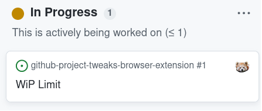
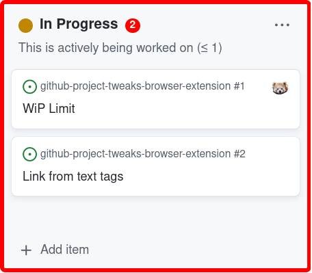

# GitHub Project Tweaks Browser Extension User Guide

## Installation

* Download `.xpi` file from the latest release of this project on GitHub
* Open the add-on settings or browse to `about:addons`
* Click the gear icon next to "Manage Your Extensions"
* In the pop-up menu click "Install Add-on From File..."
* Pick the XPI file
* Click "Open"

## Configuration of the Board

In the description of a board column add a WIP limit consisting of the `≤` symbol followed by optional space and a number.

Example text:

> This is actively being worked on (≤ 10)

Here is how this looks in the browser.

The browser extension will recognize that special sequence and take it as a WiP limit for this column. All columns that have no limit set or a limit of zero are considered columns to ignore.

## Exceeding the WiP Limit

When the WiP limit is exceeded, the item counter turns red and the board column is surrounded by a broad red border.

